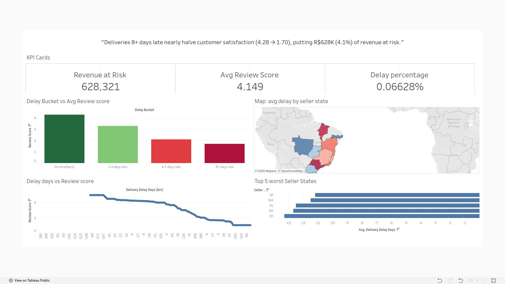

# Do Late Deliveries Kill Customer Satisfaction? — Olist E-Commerce Analysis

An end-to-end analysis of how delivery delays affect customer satisfaction and revenue, using the Olist Brazilian E-Commerce dataset. Built with MySQL, Python, and Tableau.

**[View the interactive dashboard on Tableau Public →](https://public.tableau.com/shared/H6TBG7FHP)**


*(Add your dashboard screenshot to the repo and update this path)*

---

## Business Problem

Ops leadership suspected that delivery delays were hurting customer satisfaction and revenue, but had no data to confirm it — or to know where to focus improvement efforts. This project investigates whether that suspicion holds up statistically, quantifies the revenue impact, and identifies which seller regions are driving the problem.

## Data & Tools

- **Dataset:** [Olist Brazilian E-Commerce Public Dataset](https://www.kaggle.com/datasets/olistbr/brazilian-ecommerce) — 9 relational tables covering ~96,000 orders (orders, order items, reviews, customers, sellers, payments, geolocation)
- **SQL (MySQL):** Table joins, view creation, aggregate querying
- **Python (pandas, scipy):** Data cleaning, exploratory analysis, statistical correlation testing
- **Tableau:** Interactive dashboard for stakeholder-facing visualization

## Approach

1. Imported all 9 raw Olist tables into a MySQL database
2. Built a SQL view (`vw_delivery_satisfaction`) joining orders, reviews, order items, sellers, and customers, calculating delivery delay (actual vs. estimated delivery date) per order
3. Bucketed delivery delay into four categories (On-time/early, 1–3 days late, 4–7 days late, 8+ days late) and computed average review score per bucket
4. Validated the relationship statistically in Python using Pearson and Spearman correlation
5. Quantified revenue at risk by flagging orders that were both significantly delayed and poorly reviewed
6. Identified the worst-performing seller states by average delay, filtering out states with insufficient order volume to avoid small-sample distortion
7. Built an interactive Tableau dashboard to communicate findings to a non-technical stakeholder audience

## Key Findings

- **Satisfaction drops sharply with delay:** average review score falls from **4.28** (on-time/early) to **1.70** (8+ days late)
- **The relationship is statistically significant:** Pearson correlation = -0.261, Spearman correlation = -0.171 (both p < 0.001)
- **R$628,321 (4.1% of total revenue)** is tied to orders that were both late (4+ days) and poorly reviewed (≤2 stars) — a quantifiable at-risk segment
- **Worst-performing seller states** (by average delivery delay, filtered for meaningful order volume): SP, MA, RJ, BA, DF

## Recommendation

Prioritize a logistics/fulfillment review for sellers in the lowest-performing states first, since they represent both meaningful order volume and the steepest satisfaction drop-off. Given that satisfaction declines sharply even in the 4–7 day late bucket (not just extreme delays), even modest improvements in delivery consistency in this range could meaningfully lift review scores and reduce revenue at risk.

## Limitations & Next Steps

- Delay is measured against Olist's *estimated* delivery date, not a fixed SLA — this shows correlation, not proven causation. A controlled comparison (e.g., before/after a logistics change) would be needed to confirm causal impact.
- Small-sample states (e.g., states with <100 orders) were excluded from the "worst state" ranking to avoid misleading conclusions from limited data.
- Next step: segment the analysis by product category to see whether delay sensitivity varies (e.g., perishable or high-value goods may show a stronger satisfaction drop than others).

## Repo Structure

```
├── README.md
├── .gitignore
├── dashboard_screenshot.png
├── dataset/                          # gitignored — instructions in README
├── sql/
│   └── delivery_satisfaction_view.sql
├── python/
│   └── delivery_satisfaction_eda.py
└── tableau/
    └── delivery_satisfaction_dashboard.twb
```
